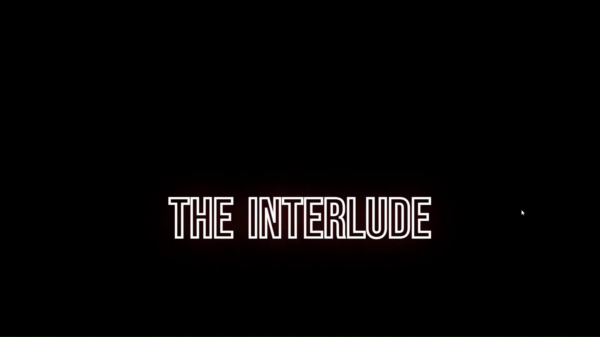
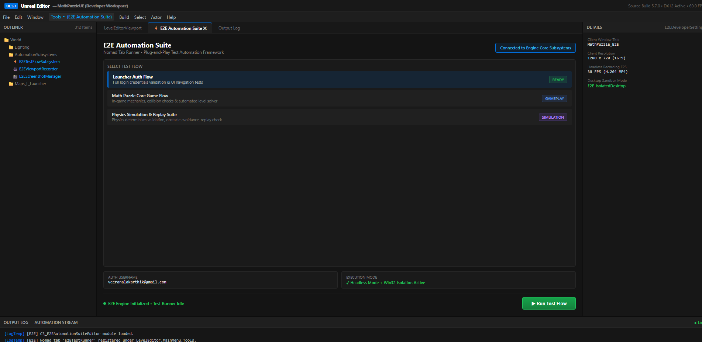
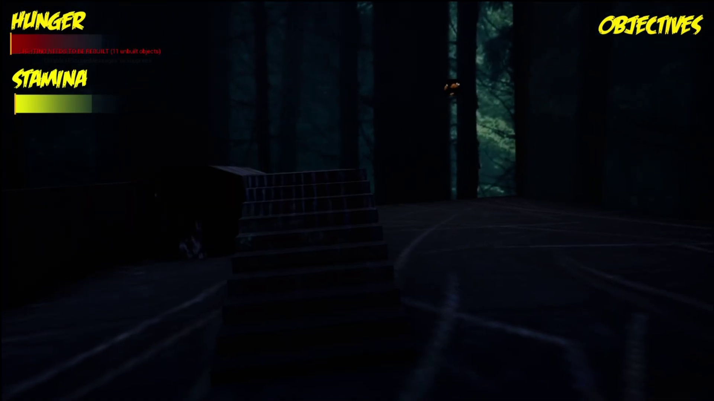
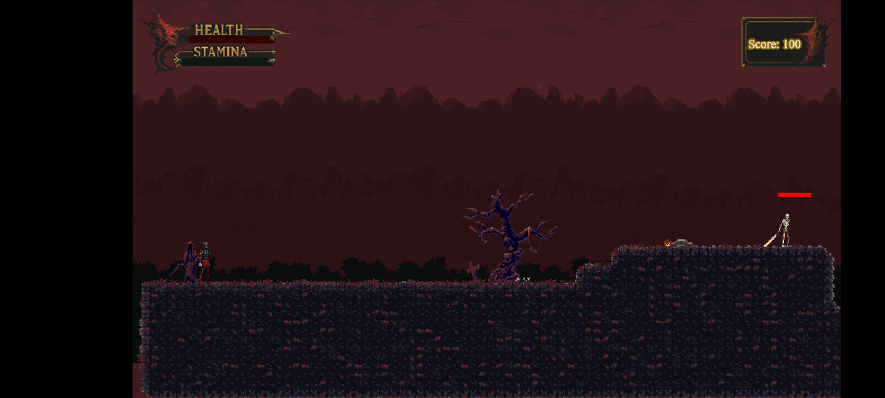
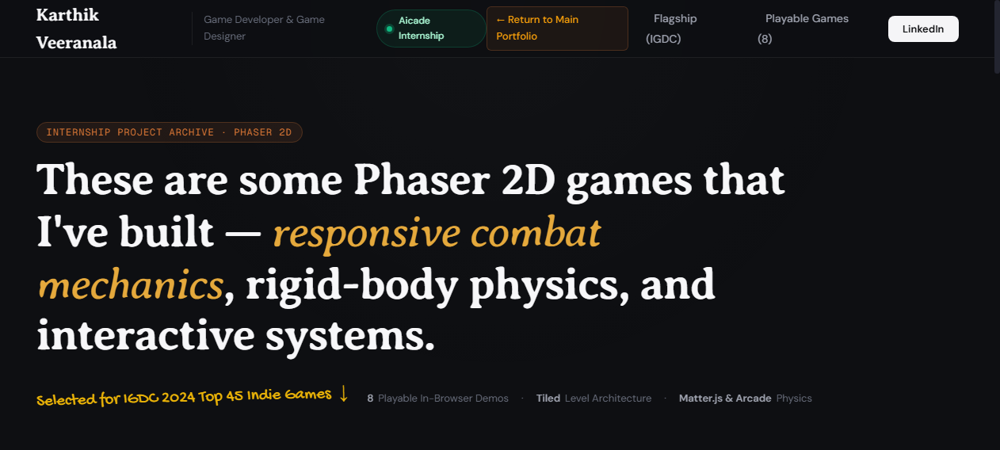

# 
 Karthik Veeranala — Game Developer & Game Designer

  
  

    
    
    
    
    
  

### 
🎮 Unreal Engine 5.7 C++ Gameplay Systems, 6-DOF Physics & Playable 2D Web Engine

---

## 🕹️ Portfolio Overview

An interactive, retro-arcade-inspired portfolio built to showcase production Unreal Engine C++ gameplay systems, custom Slate/UMG automation harnesses, 6-DOF Newtonian flight physics, and eight playable 2D HTML5/Phaser prototypes developed during my gameplay engineering tenure at **Aicade**.

- **🌐 Live Site**: [https://karthikveeranala.github.io/karthikv/](https://karthikveeranala.github.io/karthikv/)
- **🎬 Demo Reel**: [https://karthikveeranala.github.io/karthikv/demo-reel/](https://karthikveeranala.github.io/karthikv/demo-reel/)
- **🕹️ Playable Arcade Vault**: [https://karthikveeranala.github.io/karthikv/arcade/](https://karthikveeranala.github.io/karthikv/arcade/)
- **💼 LinkedIn**: [linkedin.com/in/karthikveeranala/](https://www.linkedin.com/in/karthikveeranala/)
- **💬 Discord**: `karthikkkkv`
- **✉️ Email**: [veeranalakarthik@gmail.com](mailto:veeranalakarthik@gmail.com)

---

## 🏆 Competitive Hackathons & Accolades

> 🥇 **1st Place Overall Winner** at CodeDay 2.0 with *The Interlude* (6-DOF Zero-G Space Dogfight in UE4). 
> 🥈 **2nd Place Overall Winner** at HackRush with *ByteOasis: Code to Escape* (Terminal Simulation & Environmental Puzzles). 
> 🥉 **Top 3 Overall Winner** at MLH FrostHacks with *Geek'O'Wars* (Third-Person Cyber Malware Survival). 
> 🎖️ **Top 45 Indie Finalist** at India Game Developer Conference (IGDC 2024) for *City of Aethel* (5-Hit Melee & i-Frame Dodge Rolls). 
> 🕹️ **President & Game Jam Director** at Elysium Gaming Club (Mentoring 200+ student game developers).

---

## 🚀 Flagship Game Development Projects

<table style="width:100%">
  <tr>
    <td align="center" width="50%">
      
       
      <strong><a href="https://karthikveeranala.github.io/karthikv/portfolio/the-interlude/">The Interlude (UE4 / C++)</a></strong>
       
      🥇 <b>1st Place CodeDay 2.0</b> • 6-DOF zero-g space dogfight, thruster inertia, predictive lead AI, Niagara trails.
    </td>
    <td align="center" width="50%">
      
       
      <strong><a href="https://karthikveeranala.github.io/karthikv/portfolio/e2e-automation-suite/">Headless E2E Suite (UE 5.7 C++)</a></strong>
       
      <b>Cyrus 365 Internship</b> • Win32 isolated desktops, recursive Slate/UMG discovery, raw GPU backbuffer FFmpeg streaming.
    </td>
  </tr>
  <tr>
    <td align="center" width="50%">
      
       
      <strong><a href="https://karthikveeranala.github.io/karthikv/portfolio/byteoasis/">ByteOasis: Code to Escape (UE4)</a></strong>
       
      🥈 <b>2nd Place HackRush</b> • In-game CLI terminal simulator, reflection shaders, algorithmic island puzzles.
    </td>
    <td align="center" width="50%">
      
       
      <strong><a href="https://karthikveeranala.github.io/karthikv/portfolio/geek-o-wars/">Geek'O'Wars (UE 4.21 / TPS)</a></strong>
       
      🥉 <b>Top 3 MLH FrostHacks</b> • TPS character controller, weapon overheating math, custom cyber trace shaders.
    </td>
  </tr>
  <tr>
    <td align="center" width="50%">
      
       
      <strong><a href="https://karthikveeranala.github.io/karthikv/arcade/?game=city_of_aethel">City of Aethel (Phaser 3)</a></strong>
       
      🎖️ <b>Top 45 IGDC Finalist</b> • 5-hit attack combo buffering, 180ms i-frame dodge rolls, posture-breaking parries.
    </td>
    <td align="center" width="50%">
      
       
      <strong><a href="https://karthikveeranala.github.io/karthikv/arcade/">Playable 2D Arcade Vault (8 Games)</a></strong>
       
      <b>Aicade Engineering</b> • Ragdoll physics, Matter.js ballistics, vertical shooters, and AI stealth mazes.
    </td>
  </tr>
</table>

---

## 🕹️ Playable 2D Web Prototypes (Aicade Showcase)

All eight production-grade 2D prototypes built at Aicade are bundled and playable in-browser directly via the `/arcade/` route:

1. [⚔️ **City of Aethel**](https://karthikveeranala.github.io/karthikv/arcade/?game=city_of_aethel) (Action & Combat / 16:9 Landscape) — 5-hit melee attack buffer, 180ms i-frame dodge roll, posture parries.
2. [🎯 **Total Crush: Demolition Ballistics**](https://karthikveeranala.github.io/karthikv/arcade/?game=angle_trajectory_shooter) (Physics & Ragdoll / 16:9 Landscape) — Matter.js 2D rigid-body simulation, parabolic trajectory prediction.
3. [💥 **Cannon Rampart**](https://karthikveeranala.github.io/karthikv/arcade/?game=canon_forcareer) (Action & Combat / 16:9 Landscape) — Defensive turret ballistics, wave pacing, and explosive splash radius.
4. [🤸 **Ragdoll Rampage**](https://karthikveeranala.github.io/karthikv/arcade/?game=kickthebuddy) (Physics & Ragdoll / 16:9 Landscape) — Multi-joint skeletal ragdoll with Verlet integration and spring constraints.
5. [🚀 **Skyward Cannon: Mobile Defense**](https://karthikveeranala.github.io/karthikv/arcade/?game=vertical_canon) (Action & Combat / 9:16 Portrait) — Vertical precision deflection, screen shake FX, combo multipliers.
6. [🧙 **Into the Beastverse**](https://karthikveeranala.github.io/karthikv/arcade/?game=harrypotter) (Action & Combat / 16:9 Landscape) — Projectile homing magic missiles, warding shields, boss mana phases.
7. [🔦 **Maze Runner**](https://karthikveeranala.github.io/karthikv/arcade/?game=maze_runner) (Platformer & Exploration / 16:9 Landscape) — Top-down tilemap collision, waypoint patrol AI nodes, vision cones.
8. [🪜 **Tower Ascent: Dungeon Escape**](https://karthikveeranala.github.io/karthikv/arcade/?game=vertical_maze) (Platformer & Exploration / 16:9 Landscape) — Vertical platformer, ladder state machines, precision jump buffering.

---

## 👾 Retro Features & Developer Console

- **Konami Code Activation**: Press `↑ ↑ ↓ ↓ ← → ← → B A` anywhere on the site to unlock the **Karthik V Developer Console v2.0**.
- **Interactive Companion**: Click the custom Pac-Man mascot to pause/resume movement or drag it anywhere on screen.
- **Boss Reflex Arena**: Timed reflex boss encounter on `/arcade/` featuring windup telegraphs, a golden 600ms parry window, and posture stuns.

---

## 🛠️ Technical Proficiencies & Engines

### Engines & Frameworks

[-FF6B9D?style=for-the-badge&logo=javascript&logoColor=white&labelColor=101010)](https://karthikveeranala.github.io/karthikv/arcade/)

### Languages & Core Systems

---

## 📬 Connect & Collaborate

 

  © 2026 Karthik Veeranala • Built with passion for games that feel responsive, visceral, and unforgettable.

